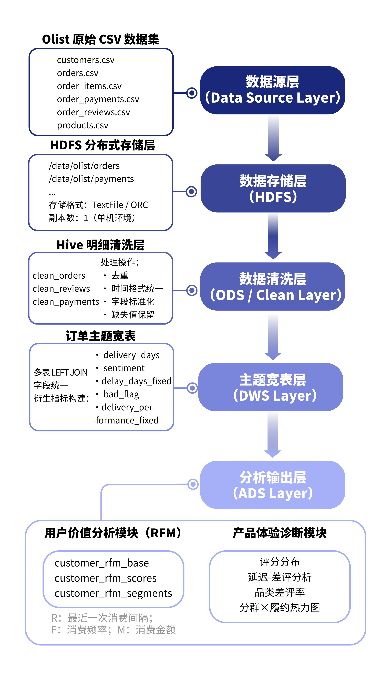

# 基于 Hive 的电商用户行为与体验诊断

> **方向**：大数据开发 · 数据仓库 · 商业分析

## 30 秒了解

| 项目 | 内容 |
| --- | --- |
| 目标 | 从多表电商数据构建 Hive 分析链路，并完成用户价值与产品体验诊断 |
| 我的工作 | 外部表设计、ODS 清洗、DWS 主题视图、RFM 分群、交付与评论分析 |
| 技术 | `Hive SQL` `HDFS` `ODS/DWS/ADS` `ETL` `Data Quality` `RFM` |
| 证据 | 数据架构图、数据质量表、用户分群表、交付与品类诊断结果 |

## 核心工作

- 设计客户、订单、支付、评论、商品、卖家和地理位置外部表。
- 完成去重、时间标准化、缺失值处理、异常标记和外键完整性检查。
- 构建订单、评论、商品和卖家 DWS 主题视图。
- 使用 `Recency / Frequency / Monetary` 完成客户评分与分群。
- 从交付延迟、评论情感、品类差评率和支付行为分析产品体验。



## 代码与结果

```text
sql/hive_schema_and_cleaning.sql # 外部表、ODS 清洗、DWS 视图
sql/customer_segmentation.sql    # RFM 特征与客户分群
results/                         # 聚合工作簿与架构图
```

运行说明见 [`sql/README.md`](sql/README.md)。执行前请替换 SQL 中的 HDFS 路径，并使用自己的公开数据副本。

## 隐私边界

不包含订单级原始数据、论文提交文件、个人身份信息或本机路径，仅保留 SQL、聚合结果、架构图和类别翻译表。
